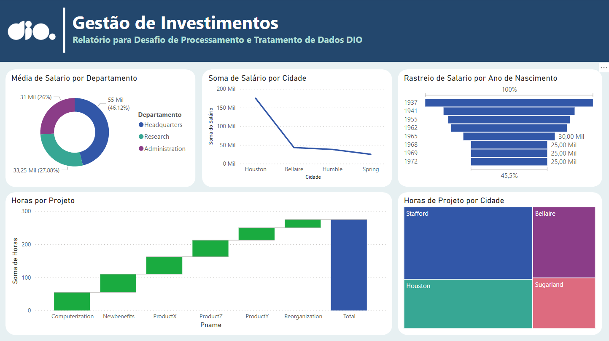
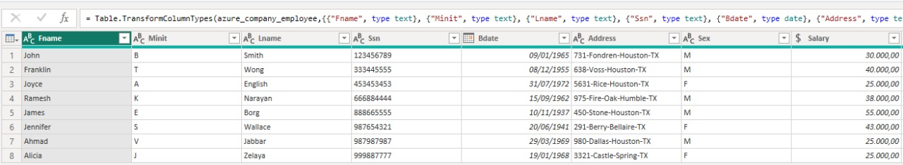
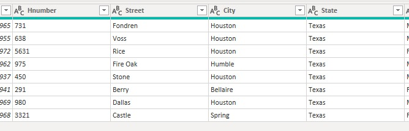
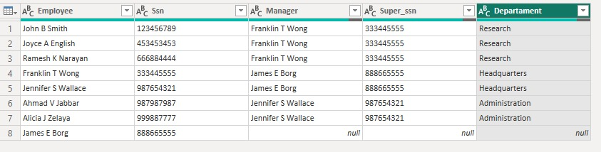
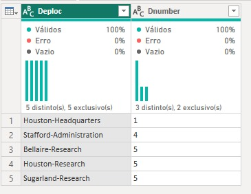
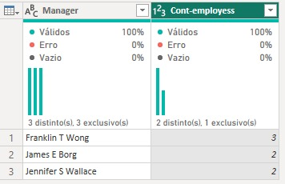

# Processando e Transformando Dados com Power BI

Este projeto foca no processamento e transformação de dados com Power BI. Realizei ajustes nos tipos de dados, separei colunas complexas e mesclei tabelas para otimizar a estrutura dos dados. O objetivo é demonstrar técnicas de tratamento e integração de dados.

## Manipulação de Dados

1. **Reordenação na Inserção de Funcionários**
   - Na construção da base de dados, apliquei uma reordenação na inserção de funcionários. Como o valor de `Super_ssn` referencia o `Ssn`, foi necessário criar uma hierarquia onde o valor de `Ssn` fosse definido antes de `Super_ssn` poder usá-lo, respeitando assim a constraint "fk_employee".

2. **Ajuste dos Tipos de Dados**
   - Durante o tratamento dos dados, os tipos foram ajustados conforme necessário. Alguns destaques incluem:
     - Valores monetários ajustados com decimal fixo.
     - Números dos departamentos, projetos e `Ssn`s mantidos como strings para permitir a categorização de dados, ao invés de serem tratados como valores numéricos usados para cálculos.

   

3. **Separação da Coluna "Address"**
   - A coluna "Address" na tabela "Employee" foi separada em colunas distintas, contendo número da casa, rua, cidade e estado.

   

4. **Junção das Tabelas Employee e Department**
   - A tabela "Employee" foi mesclada com a tabela "Department" usando o número do departamento como correspondência e utilizando uma junção externa à esquerda para garantir a inclusão de todos os funcionários, mesmo aqueles sem departamento associado.

5. **Mesclagem de Colunas de Nome e Sobrenome**
   - As colunas de nome e sobrenome dos funcionários foram mescladas para formar uma única coluna de nome completo.

6. **Junção dos Nomes dos Gerentes**
   - A tabela "Employee" foi mesclada consigo mesma, referenciando `Ssn` e `Super_ssn`, para obter o nome do gerente de cada funcionário.

   

7. **Criação de Chave Departamento-Localização**
   - Mesclei os nomes dos departamentos com suas respectivas localizações, garantindo que cada combinação departamento-local fosse única.

   

8. **Agrupamento por Gerente**
   - Os dados foram agrupados para determinar o número de colaboradores por gerente.

   

9. **Eliminação de Colunas Não Utilizadas**
   - Todas as colunas que não seriam utilizadas nos relatórios finais foram eliminadas de cada tabela, otimizando o modelo de dados para análise.

---

### O que é mesclar e o que é combinar?

- **Mesclar**: Mesclar é unir duas tabelas com base em uma coluna comum, combinando suas informações em uma única tabela. Por exemplo, mesclar uma tabela de funcionários com uma tabela de departamentos usando a coluna de ID do departamento.

- **Combinar**: Combinar é adicionar os dados de uma tabela ao final de outra tabela, criando uma tabela maior.

### Por que usar mesclar para juntar as tabelas employee e department?

Usei a mesclagem para unir as tabelas "employee" e "department" porque queremos combinar as informações dos funcionários com os nomes dos seus respectivos departamentos. Isso nos permite ter todos os dados relevantes em uma única tabela, facilitando a análise e a criação de relatórios.

### Por que não usar atribuir para a criação do departamento-local?

Não foi possivel usar a combinação para criar a tabela departamento-local porque não estamos apenas adicionando dados de uma tabela à outra. Em vez disso, estamos criando uma nova tabela de dimensão única que contém combinações específicas de departamentos e suas localizações. A mesclagem é mais apropriada aqui porque precisamos garantir que cada combinação departamento-local seja única e completa.
.